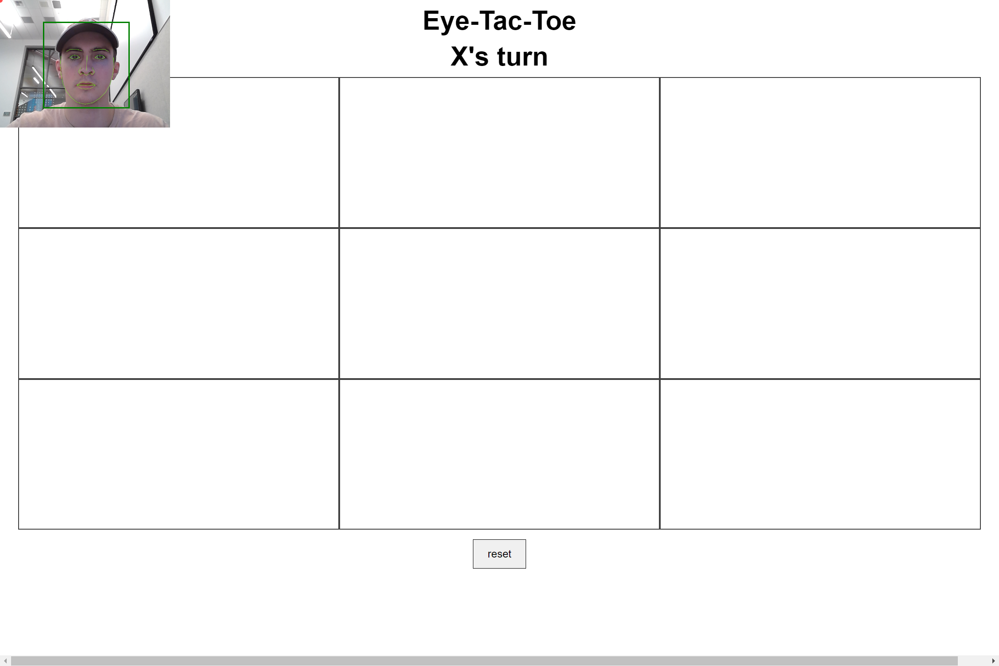
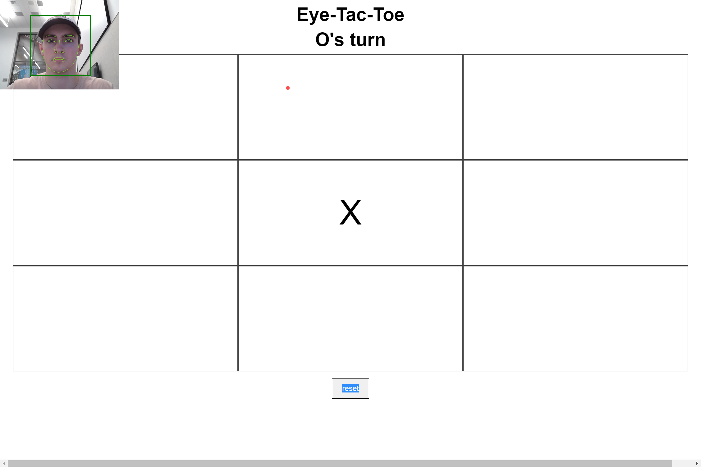

# Eye Tac Toe
This is a project that was developed during Crimson Code 2020
Tier 2 Judging Category
## Getting Started

Everything is included in the github.

### Prerequisites

js compiler

### Installing

NA

## Running the tests

Different calibration methods to attempt to increase the accuracy of the eye tracker.
A lot of debugging during development of code.

Start
 

Game in play

## Deployment

Deploy on index.html (chrome).

## Built With

* [WebGazer](https://webgazer.cs.brown.edu/) - The web framework used

## Versioning

For the versions available, see the [tags on this repository](https://webgazer.cs.brown.edu/). 

## Authors

* Christian Rouhana
* Ben Nachmanson
* Jeff Bailie

## Acknowledgments

* [WebGazer.js](https://webgazer.cs.brown.edu/)

Alexandra Papoutsaki, Patsorn Sangkloy, James Laskey, Nediyana Daskalova, Jeff Huang, and James Hays. Webgazer: Scalable webcam eye tracking using user interactions. In Proceedings of the 25th International Joint Conference on Artificial Intelligence (IJCAI), pages 3839--3845. AAAI, 2016.
